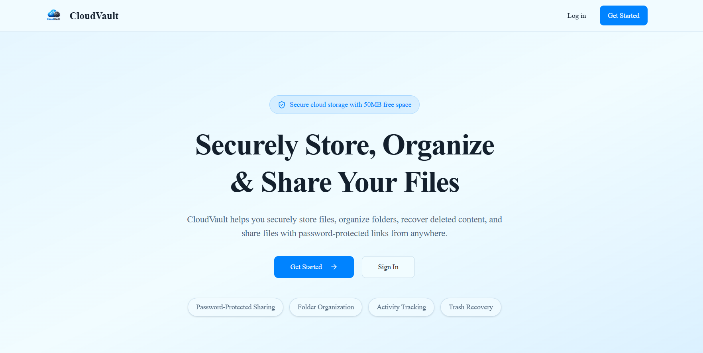
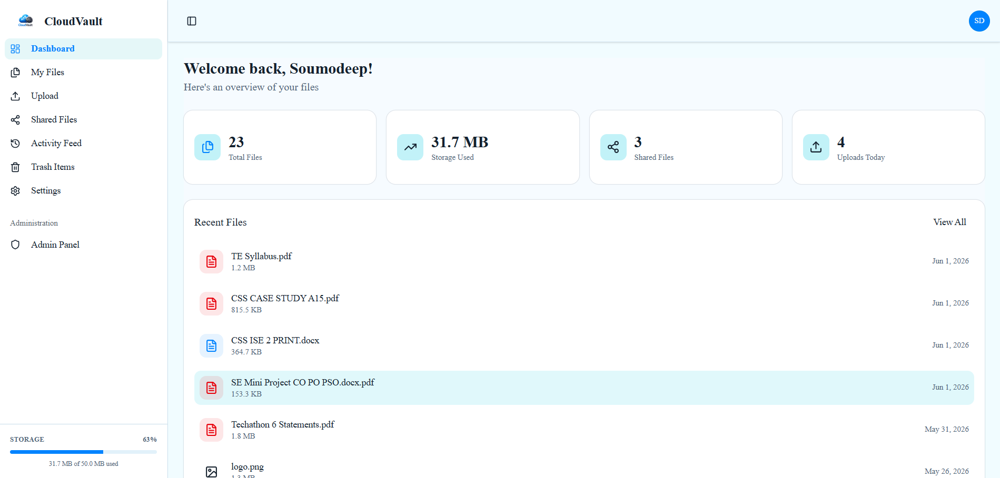
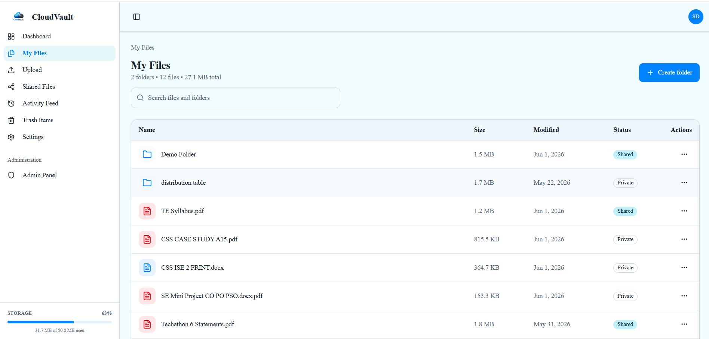
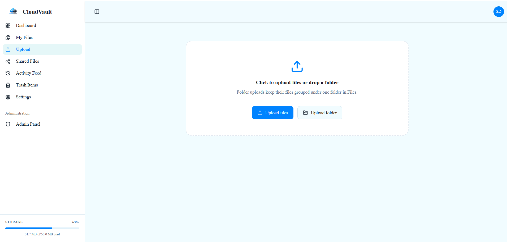
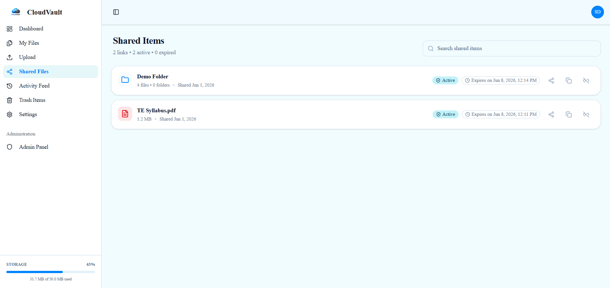
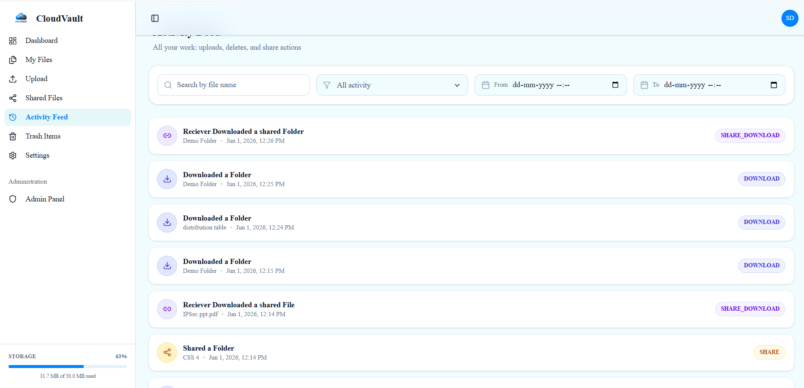
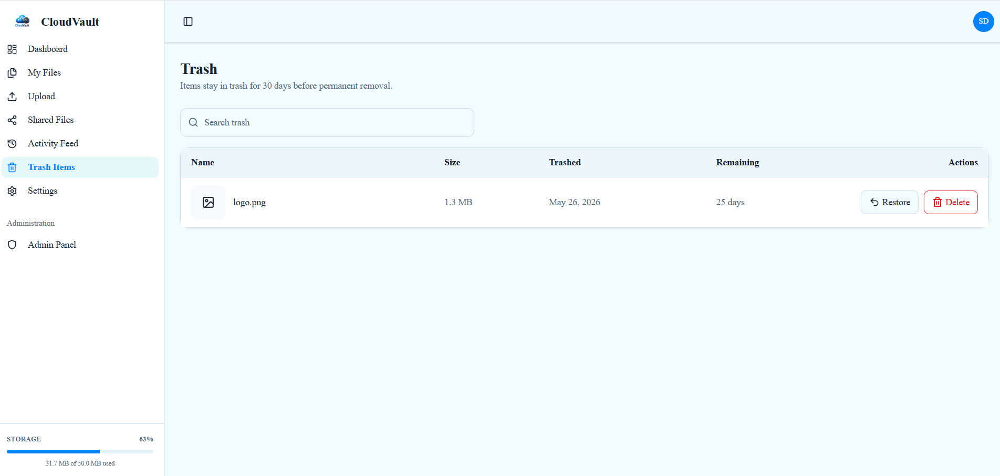
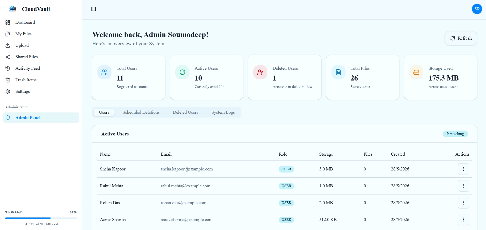

# CloudVault

[](https://nextjs.org/)
[](https://react.dev/)
[](https://www.typescriptlang.org/)
[](https://www.prisma.io/)
[](https://www.postgresql.org/)
[](https://supabase.com/)
[](https://tailwindcss.com/)
[](./LICENSE)

CloudVault is a secure cloud storage platform that allows users to upload, organize, share, recover, and manage files through a modern web interface. It supports file uploads, folder organization, password-protected share links, activity tracking, trash recovery, and admin account management.

## Features

### Authentication and account management
  - Email signup and login
  - Email verification
  - Password reset
  - Profile updates and password changes
  - Account deletion and restore flow

### Files and folders
  - Upload files to storage
  - Create, rename, move, and delete folders
  - Upload files into folders
  - Download files and folders
  - File previews for supported formats
  - Search across files and folders

### Sharing
- Secure file sharing
- Secure folder sharing with nested folder support
- Password-protected share links
- Expiring public links
- Shared items management and revoke actions

### Activity and Recovery
- Detailed activity history and audit tracking
- Activity metadata logging
- Trash with restore and permanent delete actions
- Automatic cleanup of expired trash after 30 days

### Admin tools
  - Admin dashboard
  - User management
  - Storage usage overview
  - System logs and deletion flow visibility

## Tech Stack

- Next.js 16 App Router
- React 19
- TypeScript
- Prisma
- PostgreSQL
- Supabase Storage
- Tailwind CSS
- shadcn/ui
- Nodemailer
- bcryptjs
- JSON Web Tokens

## Screenshots

### Landing Page


### Dashboard


### Files Dashboard


### Uploading Page


### Secure Sharing


### Activity Tracking


### Trash & Recovery


### Admin Dashboard


## Installation

```bash
git clone https://github.com/Soumodeep084/cloudvault-storage-platform.git
cd cloudvault-storage-platform
npm install
npx prisma migrate dev
npx prisma generate
```

## Environment Variables

Create a `.env` file with the variables below:

```env
JWT_SECRET=your_jwt_secret
SHARE_ACCESS_COOKIE_SECRET=your_share_access_cookie_secret

SHARE_BASE_URL=http://localhost:3000

NEXT_PUBLIC_SUPABASE_URL=https://...
NEXT_PUBLIC_SUPABASE_ANON_KEY=your_supabase_anon_key
SUPABASE_SERVICE_ROLE_KEY=your_supabase_service_role_key
DATABASE_URL=postgresql://...

GMAIL_USER=your_gmail
GMAIL_APP_PASSWORD=your_gmail_app_password
EMAIL_SIGNATURE=- CloudVault Team
```

## Running Locally

```bash
npm run dev
```

Then open `http://localhost:3000`.

## Project Structure

```text
app/
  actions/          Server actions for auth, files, folders, admin, and trash
  api/              Route handlers for auth, downloads, previews, and cleanup
  dashboard/        User dashboard, files, shared items, history, trash, settings
components/         Shared UI and dashboard components
lib/                Auth, storage, email, share, admin, and utility helpers
prisma/             Database schema and migrations
public/             Static assets
types/              Shared TypeScript types
proxy.ts            Route protection and request handling
```

## Security Features

- HttpOnly session cookies backed by signed JWTs
- Email verification flow for new accounts
- Password reset links with token expiry
- Password-protected share links
- Expiring share links
- Trash retention with scheduled cleanup
- Admin-only access to the admin dashboard and user actions

## Deployment

- Build the app with `npm run build`.
- Set the production environment variables listed above.
- Provision PostgreSQL and a Supabase Storage bucket named `files`.
- Deploy to Vercel or any Node host that supports Next.js App Router.

## Author

Soumodeep Tarak Dutta

